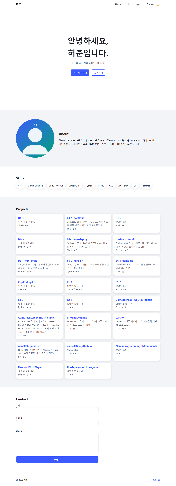
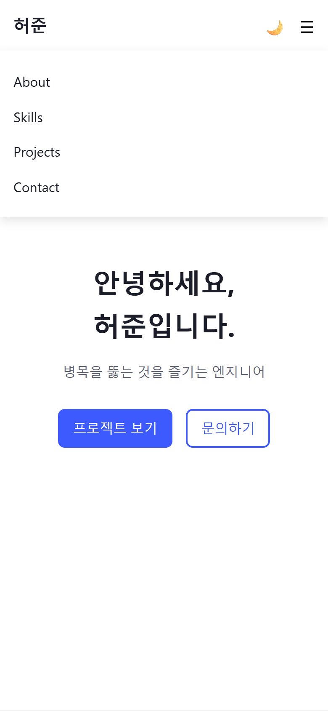
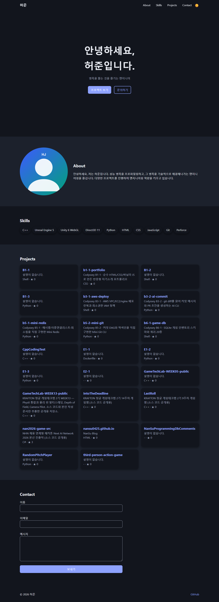

# 나를 소개하는 웹페이지 (B1-1)

외부 라이브러리 없이 HTML · CSS · JavaScript 만으로 만든 반응형 포트폴리오입니다. 미션 원문은 [MISSION.md](MISSION.md) 에 있습니다.

## 배포 URL

https://nansu0425.github.io/b1-1-portfolio/

## 사용 기술

- HTML5 시맨틱 태그 (`header` `nav` `main` `section` `article` `footer`)
- CSS3 — `:root` 변수, `[data-theme="dark"]`, Flexbox(네비게이션), Grid(`auto-fit` + `minmax`, Projects 카드), 모바일 퍼스트 미디어 쿼리(768px · 1024px)
- JavaScript (ES6+) — DOM 조작, `addEventListener`, `fetch` + `async/await`, `IntersectionObserver`, `localStorage`
- GitHub REST API — `https://api.github.com/users/nansu0425/repos`

## 구조

```text
index.html
css/style.css
js/main.js
images/profile.svg
```

`js/main.js` 에는 기능별로 "이벤트 → 상태 변경 → 화면 업데이트" 흐름이 있습니다.

| 기능 | 이벤트 | 상태 | 화면 |
|---|---|---|---|
| 다크 모드 | 토글 click | `theme` (`localStorage` 저장) | `<html data-theme>` |
| Projects | 페이지 로드 · 다시 시도 click | `loading` / `success` / `empty` / `error` | 로딩 문구 · 카드 · 빈 상태 · 에러 + 재시도 버튼 |
| Contact 폼 | input · submit | 필드별 에러 메시지 | 에러 문구 표시/숨김 · 성공 메시지 |

## 인터랙션 기준값

| 항목 | 값 |
|---|---|
| 네비게이션 배경 변경 | 스크롤 60px 초과 |
| 스크롤 탑 버튼 표시 | 스크롤 300px 초과 |
| 스크롤 애니메이션 threshold | 0.2 |

## 스크린샷

| 데스크톱 | 모바일 | 다크 모드 |
|---|---|---|
|  |  |  |

## 학습 자료

- [웹 기초 교재](https://nansu0425.github.io/b1-1-portfolio/docs/primer.html) — 이 프로젝트 코드를 읽는 데 필요한 HTML · CSS · JS · 비동기 배경지식
- [포트폴리오 해설](https://nansu0425.github.io/b1-1-portfolio/docs/guide.html) — 과제 목표별 구현 설명, 예상 질문, 시연 순서

## 로컬 실행

VS Code 에서 폴더를 열고 Live Server 확장의 **Go Live** 를 누릅니다.
